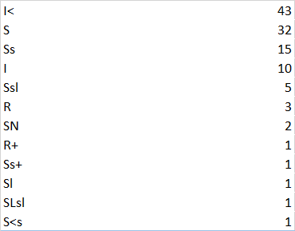

# devops-os-1
1. Запускаем в терминале strace /bin/bash -c 'cd /tmp'
В полученном выводе ищем системный вызов, который относится к ls:
   chdir("/tmp")
   
Проверяем нашу догадку, ищем в мануале описание системного вызова chdir:

man 2 chdir

DESCRIPTION
       chdir() changes the current working directory of the calling process to the directory specified in path.

2. Запускаем в терминале strace file
Привлекает внимание строка 
   read(3, "# Locale name alias data base.\n#"..., 4096) = 2996
   
Ищем около нее:
openat(AT_FDCWD, "/etc/magic.mgc", O_RDONLY) = -1 ENOENT (No such file or directory)
openat(AT_FDCWD, "/etc/magic", O_RDONLY) = 3
Проверяем догадку. Гугл подсказывает, что если есть скомпилированный файл, то информация считывается из /etc/magic.mgc. Если компиляции не существует, используется /etc/magic.

3. Нужно перенаправить выходной поток приложения, чтобы предотвратить дальнейший рост файла с помощью команды >, например:

: > /path/to/the/file.log

Затем ищем PID процесса, в котором открыт файл:

lsof -nP +L1

Обрезаем файл:

: > "/proc/$pid/fd/$fd"

Где в $pid находится идентификатор процесса, в котором открыт файл, и $fd - дескриптор файла, в котором он был открыт. Его можно найти через lsof -p "$pid".

4. Зомби-процессы не занимают ресурсы в ОС, т.к. это процессы, которые после своего завершения остались в таблице процессов. Но при завершении процесса все ресурсы освобождаются, поэтому такие процессы не тратят ресурсы ОС.
Тем не менее, такие процессы блокируют записи в таблице процессов, размер которой ограничен для каждого пользователя и системы в целом.
   
5. После установки пакета bpfcc-tools запускаем:
   
strace dpkg -L bpfcc-tools | grep sbin/opensnoop

Были запущены следующие вызовы из группы open:

openat(AT_FDCWD, "/etc/ld.so.cache", O_RDONLY|O_CLOEXEC) = 3

openat(AT_FDCWD, "/lib/x86_64-linux-gnu/libselinux.so.1", O_RDONLY|O_CLOEXEC) = 3

openat(AT_FDCWD, "/lib/x86_64-linux-gnu/libc.so.6", O_RDONLY|O_CLOEXEC) = 3

openat(AT_FDCWD, "/lib/x86_64-linux-gnu/libpcre2-8.so.0", O_RDONLY|O_CLOEXEC) = 3

openat(AT_FDCWD, "/lib/x86_64-linux-gnu/libdl.so.2", O_RDONLY|O_CLOEXEC) = 3

openat(AT_FDCWD, "/lib/x86_64-linux-gnu/libpthread.so.0", O_RDONLY|O_CLOEXEC) = 3

openat(AT_FDCWD, "/proc/filesystems", O_RDONLY|O_CLOEXEC) = 3

openat(AT_FDCWD, "/usr/lib/locale/locale-archive", O_RDONLY|O_CLOEXEC) = 3

openat(AT_FDCWD, "/etc/dpkg/dpkg.cfg.d", O_RDONLY|O_NONBLOCK|O_CLOEXEC|O_DIRECTORY) = 3

openat(AT_FDCWD, "/etc/dpkg/dpkg.cfg.d/excludes", O_RDONLY) = 3

openat(AT_FDCWD, "/etc/dpkg/dpkg.cfg", O_RDONLY) = 3

openat(AT_FDCWD, "/home/vagrant/.dpkg.cfg", O_RDONLY) = -1 ENOENT (No such file or directory)

openat(AT_FDCWD, "/etc/ld.so.cache", O_RDONLY|O_CLOEXEC) = 3

openat(AT_FDCWD, "/lib/x86_64-linux-gnu/libc.so.6", O_RDONLY|O_CLOEXEC) = 3

openat(AT_FDCWD, "/usr/lib/locale/locale-archive", O_RDONLY|O_CLOEXEC) = 3

openat(AT_FDCWD, "/var/lib/dpkg/arch", O_RDONLY) = 3

openat(AT_FDCWD, "/var/lib/dpkg/status", O_RDONLY) = 3

openat(AT_FDCWD, "/var/lib/dpkg/updates/", O_RDONLY|O_NONBLOCK|O_CLOEXEC|O_DIRECTORY) = 3

openat(AT_FDCWD, "/var/lib/dpkg/triggers/File", O_RDONLY) = 3

openat(AT_FDCWD, "/var/lib/dpkg/triggers/Unincorp", O_RDONLY) = 3

openat(AT_FDCWD, "/var/lib/dpkg/info/format", O_RDONLY) = 4

openat(AT_FDCWD, "/var/lib/dpkg/info/bpfcc-tools.list", O_RDONLY) = 4

openat(AT_FDCWD, "/var/lib/dpkg/diversions", O_RDONLY) = 4

openat(AT_FDCWD, "/usr/share/locale/locale.alias", O_RDONLY|O_CLOEXEC) = 5

openat(AT_FDCWD, "/usr/share/locale/en_US/LC_MESSAGES/dpkg.mo", O_RDONLY) = -1 ENOENT (No such file or directory)

openat(AT_FDCWD, "/usr/share/locale/en/LC_MESSAGES/dpkg.mo", O_RDONLY) = -1 ENOENT (No such file or directory)

openat(AT_FDCWD, "/usr/share/locale-langpack/en_US/LC_MESSAGES/dpkg.mo", O_RDONLY) = -1 ENOENT (No such file or directory)

openat(AT_FDCWD, "/usr/share/locale-langpack/en/LC_MESSAGES/dpkg.mo", O_RDONLY) = -1 ENOENT (No such file or directory)

6. Используется системный вызов uname({sysname="Linux", nodename="Alex", ...}) = 0
Part of the utsname information is also accessible via /proc/sys/kernel/{ostype, hostname, osrelease, version, domainname}.
7. Оператор ; разделяет команды, которые будут выполняться последовательно. При этом вторая команда выполнится независимо от результата выполнения первой.
Оператор && - это логическое И. Вторая команда выполняется в том, и только в том случае, если статус выхода из команды1 равен нулю, что говорит об успешном ее завершении.
   set -e изменяет поведение таким образом, что выполняется выход, как только команда, Pipeline, List или Compound command возвращает ненулевой статус. При этом выход не выполняется, если неуспешно заканчивается любая из команд, разделенных &&, кроме последней команды.
    
8. Режим bash set -euxo pipefail состоит из следующих опций:
-e: завершить выполнение, как только команда выдает ненулевой статус
   -u: рассматривать неустановленные переменные как ошибку
   -x: выводить команды и их аргументы при выполнении
   -o pipeline: выводит статус последней команды, которая завершилась ненулвым статусом.
   
Польза от использования такого выражения в сценариях - будет выполнен анализ команды в сценарии, которая приводит к ошибке. Будет выведено ее название, аргументы и итоговый статус.

9. С помощью команды ps -o stat -A выводим статусы всех процессов в системе. Группировкий получаем:

   
   Схлопываем статусы из одной группы:
   
   

Чаще всего встречается статус S (interruptible sleep (waiting for an event to complete).